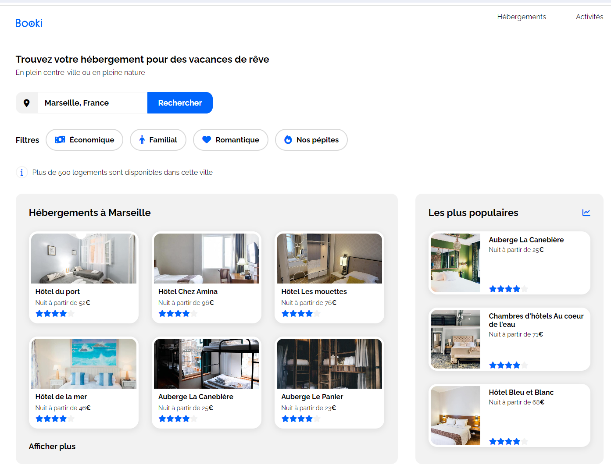

# booki

Projet 2 du parcours "**Développeur d'application - JavaScript React**" chez [OpenClassroom](https://openclassrooms.com/fr/).

Créez la page d’accueil d’une agence de voyage avec HTML & CSS.

# Description

Vous débutez votre alternance en tant que développeur web au sein de la start-up Booki.

L’entreprise souhaite développer un site Internet qui permette aux usagers de trouver des hébergements et des activités dans la ville de leur choix.

Vous êtes chargé d'intégrer l'interface du site avec du code HTML et CSS. Pour cela, vous travaillez en étroite collaboration avec Sarah, la CTO, et Loïc, l’UI designer.

## Objectifs

L'objectif est d'intégrer une maquette depuis Figma, aussi bien en version bureau, tablette que mobile.

## Spécifications fonctionnelles

### Fonction recherche

- Les usagers pourront rechercher des hébergements dans la ville de leur choix.
- Le champ de recherche est un champ de saisie, le texte doit donc pouvoir être
  édité par l’utilisateur.
- Il faut englober ce champ dans un formulaire. La partie Recherche ne doit pas
  être fonctionnelle - il s’agit d’une première version pour valider l’interface.

### Liens **Hebergements** et **Activités**

Les textes "**Hébergements**" et "**Activités**", situés dans l'en-tête, sont des liens, ils doivent mener respectivement vers la section "**Hébergements à Marseille**" et "**Activités à Marseille**"

### Cartes hébergements et activités

- Chaque **carte** d’hébergement ou d’activité devra être **cliquable** dans son
  intégralité (pas uniquement le titre).
- Pour l’instant, les liens sont vides. On peut utiliser un attribut `href=”#”` pour
  simuler la présence d’un lien.

### Filtres de recherche

- Les hébergements peuvent être filtrés par thématique, comme le budget ou
  l’ambiance.
- Les filtres doivent changer de couleur au survol de la souris.
- Les filtres ne doivent pas être fonctionnels - il s’agit juste d’une première version
  pour valider l’interface.

## Spécifications techniques

### Maquettes

Trois maquettes ont été réalisées : **desktop**, **tablette** et **mobile**.

## Breakpoints

Nous avons convenu avec le designer UI d’utiliser _1024 px_ et _768 px_ :

- \> _1024 px_ pour les écrans d’ordinateurs ;
- \>= _768 px_ pour les tablettes ;
- et tout ce qui est en dessous de _768 px_ pour les téléphones portables.

## Largeur min - max

Pour éviter d’étirer la page web sur la largeur de façon excessive, il va falloir déterminer
une largeur maximum de _1440 px_. Au-delà, une marge blanche doit apparaître sur les
côtés et le contenu doit se limiter à _1440 px_ de large.
La largeur minimum est fixée à _320 px_, en-deçà de cette largeur, le comportement n’est
pas garanti.

## Desktop first

Il faut d’abord réaliser l’intégration pour les ordinateurs (autrement dit, en desktop first),
puis les tablettes et enfin les téléphones. L’utilisation des _Media Queries_ nous permettra
de réaliser l’intégration pour les différents supports.

## Bibliothèque d'icônes

Les icônes proviennent de la bibliothèque [Font Awesome](https://fontawesome.com/).

## Couleurs

Les couleurs de la charte sont le **bleu** (_#0065fc_), le **bleu clair** (_#deebff_) et le **gris** pour le
fond (_#f2f2f2_).

## Police

La police du site est Raleway. Nous pouvons passer par **Google Fonts** pour importer
facilement cette police dans le code : https://fonts.google.com/specimen/Raleway.

## Mise en page

Il est recommandé d'utiliser **Flexbox**.

## Balises sémantiques

Il est important d’utiliser des balises sémantiques, au minimum “**header**”, “**nav**”,
“**h1-h2-h3**”, “**main**”, “**section**”, “**article**” et “**footer**”.

## Validité du code

- Aucun IDE ou éditeur de code particulier n’est imposé pour le développement.
- Le code doit être valide aux validateurs **W3C** HTML et CSS.
- Le code HTML ne doit pas contenir de propriété CSS.
- Lors du passage du desktop au mobile et à la tablette, **ne pas dupliquer le code
  HTML** (exception faite dans le formulaire avec le mot “Rechercher” et l’icône de la
  loupe).
- **Privilégier l’utilisation des classes CSS** pour cibler un élément, plutôt que d’utiliser
  le nom de l’élément lui-même.
- Ne pas **dupliquer** des classes CSS inutilement. Exemple : si 4 éléments sont
  identiques du point de vue de la mise en forme, alors utiliser une seule et même
  classe CSS, et non pas 4.

## Compatibilité navigateurs

La maquette doit être compatible avec les dernières versions de **Google Chrome** et de
**Mozilla Firefox**.
Il faudra tester la page web sur ces deux navigateurs.

## Restrictions

Aucun **framework CSS** (type BootStrap ou Tailwind CSS) ou **préprocesseur CSS** (type Sass
ou Less) ne doit être utilisé.
Aucun autre **langage** ne doit être utilisé (comme JavaScript, par exemple).

## Tester

Vous trouverez le lien pour tester l'application [ici](https://code9g.github.io/booki/)

>)

